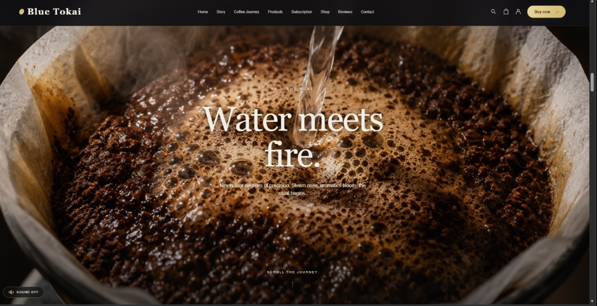

# Coffee Design 2

> A premium coffee website design inspired by Blue Tokai — featuring scroll-controlled animations, GSAP motion sequences, and a full product shop.

## Quick Start

Run `node server.cjs` in this folder, then visit **http://127.0.0.1:4174/**

## Features

- Seven scroll-controlled stages with GSAP animations
- Nine products with filters, sorting, search, quick views and local cart
- Six category tiles, subscription plans, best sellers, process steps
- Responsive layouts, keyboard navigation, reduced-motion fallback
- Optional ambient sound, activated only by the user

## Tech Stack

| | |
|---|---|
| **UI** | React 19 |
| **Animation** | GSAP 3 |
| **Bundler** | esbuild |
| **Server** | Node.js |

## Main Files

| File | Purpose |
| --- | --- |
| src/App.jsx | Main sections and interactions |
| src/journey.js | Reference sequence and background timing |
| src/motion.js | GSAP timeline and scroll reveals |
| src/shop.js | Catalogue and cart calculations |
| style.css | Base layout and responsive styling |
| assets/ | Project photographs |
| server.cjs | Preview server on port 4174 |
